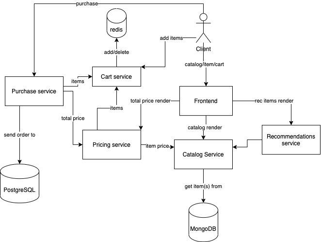

docker run --name catalog-mongo --net=microservices-shop -v mongo:/data/db -d --rm mongo
docker run --rm --name redis-cart --net=microservices-shop -d redis
docker run --name orders-pg -e POSTGRES_PASSWORD=password --rm --net=microservices-shop -d postgres
docker run --name catalogservice --rm -e MONGO_URI=mongodb://catalog-mongo:27017 --net=microservices-shop -d catalogservice
docker run --name cartservice --rm -e REDIS_ADDR=redis-cart:6379 --net=microservices-shop -d cartservice
docker run --name pricingservice --rm -e CART_SVC_GRPC_PORT=cartservice:9082 -e CATALOG_SVC_GRPC_PORT=catalogservice:9081 --net=microservices-shop -d pricingservice
docker run --name recommendationservice --rm -e CATALOG_SVC_GRPC_PORT=catalogservice:9081 --net=microservices-shop -d recommendationservice
docker run --name purchaseservice --rm -e CART_SVC_GRPC_PORT=cartservice:9082 -e PRICING_SVC_GRPC_PORT=pricingservice:9083 -e POSTGRES_HOST=orders-pg --net=microservices-shop -d purchaseservice
docker run --name frontend -p 80:80 --net=microservices-shop -d --rm frontend
